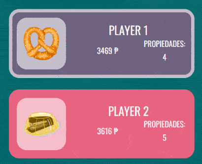

<!-- Logo -->
<div align="center" >


</div>

<!-- Content -->
4 player Monopoly web game made with HTML, SASS, PHP and JavaScript (vanilla, without any framework) with inspiration from *The Office* series.

The players names and icons are stored in a SQL database.

You can try a **fully** functional version [here](https://la-lo-go.github.io/the-PHPoly/index_html.html) but note that the names of the players and their icons are set by default and there is not any database hosted there so, if you summit the restart form, it throw an error.

## Gameplay 


Players roll a dice (hitting the 🎲 icon) and choose whether to buy the propertie (🪙) or pass (➡️) and if they land on others' properties, they automatically pay rent. The game ends when only one player remains.

The game can be restarted clicking the ♻️ icon and a form will appear to enter the names and preffered icon of the players.


## UI Details
| Transaction between players  | Dice and buttons switch |
|:---:|:-----------------------:|
|||

**Properties purchased by the players**


**New Player form**


## Deploy
1. Copy or clone the repository into your PHP folder
   ```bash
    git clone https://github.com/la-lo-go/the-PHPoly
   ```
2. Import the database (the [thephpoly.sql](./thephpoly.sql) file) into your MySQL server.
3. If necessary, change the `$host`, `$user` or `$pass` values in the [conexion.php](./conexion.php) file with the keys of your database server.
4. Run the PHP and SQL server and enter to the [index.php](./index.php) page

## Documentation
<details> 
   <summary>Expand to see the diagrams</summary>

   | Use cases  | Navigation flow |
   |:---:|:-----------------------:|
   |||

   | Class diagram  | Architecture |
   |:---:|:-----------------------:|
   |||
</details>

## Final notes
I wish this was a complete port but it is not, this was part of my first course final project so a lot of stuff that I would have liked to implement, like building or cards, are not here.

So... that's it! Thanks! 🤠

## References and credits
1. [Monopoly board skeleton](https://codepen.io/johnnycopes/pen/yzQyMp) from [@johnnycopes](https://github.com/johnnycopes)
2. [3D dice with CSS](https://codepen.io/abirana/pen/rNMLrPB) from [@abirana](https://github.com/abirana)
